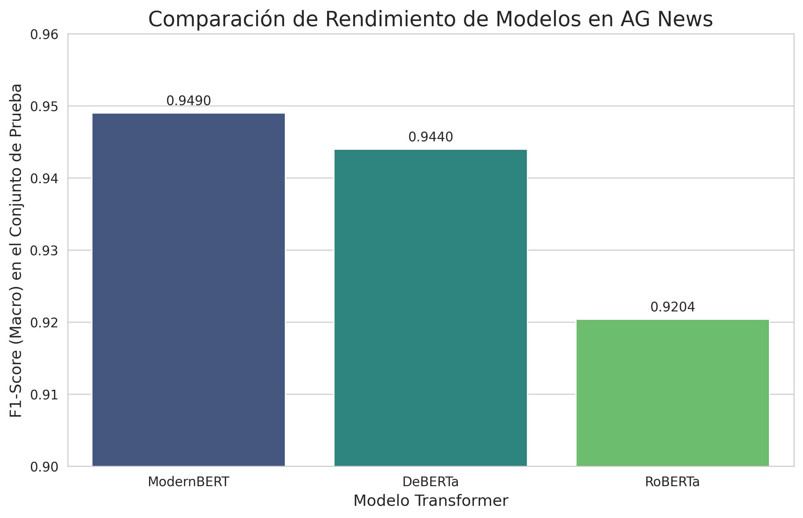

# News_Classification-lab

Este proyecto se enfoca en la evaluación comparativa de tres modelos Transformer (RoBERTa, DeBERTa y ModernBERT) para la tarea de clasificación de noticias, utilizando el dataset "AG News".

##  Comparación de Rendimiento

El entrenamiento se realizó durante 2 épocas para cada modelo, utilizando una configuración estandarizada para asegurar una comparación justa. La métrica de evaluación principal fue el **F1-Score (Macro)**, calculada sobre el conjunto de prueba (test set), que los modelos no vieron durante el entrenamiento.

Los resultados finales se resumen en el siguiente gráfico:

##  Análisis e Interpretación de Resultados

Tras completar el ciclo de entrenamiento y evaluación, se obtuvieron los siguientes hallazgos:

1.  **Mejor Modelo:** El modelo con el rendimiento más alto fue **ModernBERT**, alcanzando un F1-Score de **0.9490**. Este resultado es notable, sugiriendo que su arquitectura más reciente, a pesar de no ser tan conocida como las otras, está excepcionalmente bien adaptada para tareas de clasificación de texto de dominio general.

2.  **Análisis Comparativo:**
    * **DeBERTa (0.9440)** se posicionó en segundo lugar, superando a RoBERTa. Esto es consistente con la literatura técnica, ya que DeBERTa introduce mejoras como la atención desvinculada (disentangled attention), que le permite modelar de manera más efectiva las relaciones entre palabras y sus posiciones, resultando en una mejor comprensión semántica.
    * **RoBERTa (0.9204)**, aunque obtuvo un excelente resultado, fue el de menor rendimiento de los tres. Si bien es un modelo muy robusto, su arquitectura es la más "clásica" del grupo, y los avances implementados en DeBERTa y ModernBERT demuestran ser efectivos para esta tarea.

3.  **Conclusión General:**
    Todos los modelos demostraron ser altamente competentes, con F1-Scores superiores a 0.92, lo que valida la eficacia de la transferencia de aprendizaje (transfer learning) con Transformers para la clasificación de noticias. Aunque las diferencias son relativamente pequeñas, **ModernBERT se destaca como la opción más precisa** en este experimento, seguido de cerca por DeBERTa.

---

  **Ejecutar el Notebook:**
    Abrir y ejecutar `notebooks/agnews_train_eval.ipynb` en un entorno como Google Colab (recomendado por el uso de GPU).
